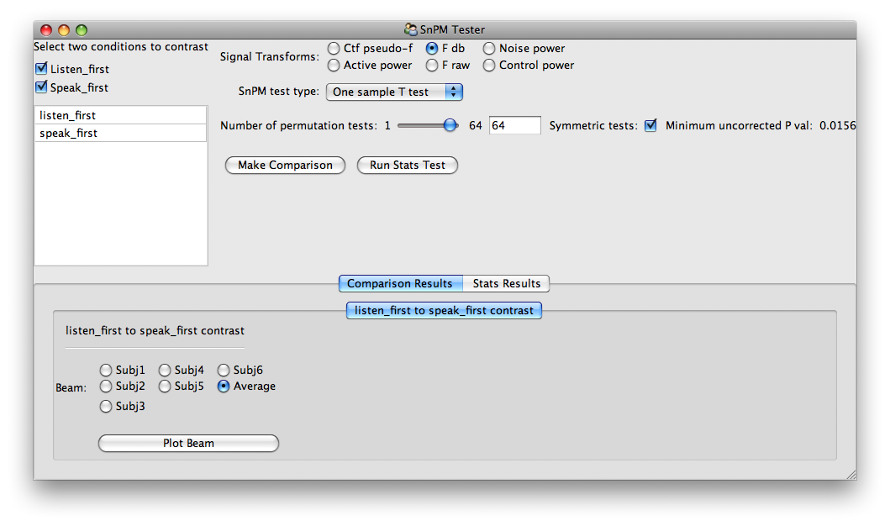

========================
Using The Stats UI Tools
========================

**Note: when running GUIs, it is helpful to run ipython in a threaded mode**::

    (nutmeg-py)bash-3.2$ ipython -q4thread

Now import the :mod:`~nutmeg.stats.ui.stats_ui` tools::

    >>> from nutmeg.stats.ui import stats_ui

List Of Conditions App
^^^^^^^^^^^^^^^^^^^^^^

::

    >>> ui = stats_ui.ListOfConditions()
    >>> ui.edit_traits()

.. image:: list_of_conds.png

Now add conditions and subjects as needed using "Append Conditions" and by increasing the "Number of Subjects". All the condition and subject labels are fully editable.

To search for the path to the TFBeam (or s_beam) file, double click on the "File Path" entry for a subject.

Once you have created the list of conditions, you can select one or more conditions to compare on the bottom left list of Available Conditions. Then you may create a :class:`~nutmeg.stats.beam_stats.BeamComparator` using one of the two buttons at the bottom right.

.. image:: list_of_conds_complete.png

SnPM Tester App
^^^^^^^^^^^^^^^

With this window, you may make comparisons, run the SnPM tests, and view the results. When defining contrasts, note that the selection of conditions is ordered.

After the test or comparison is performed, then a new panel will show up in the tabbed area at the bottom of the window.

.. image:: snpm_tester_ran.png
